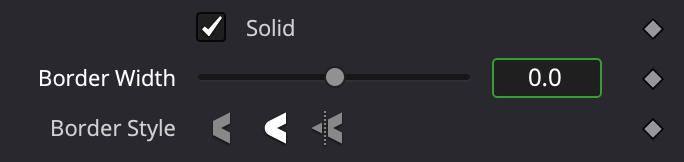
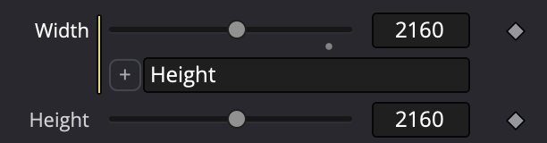
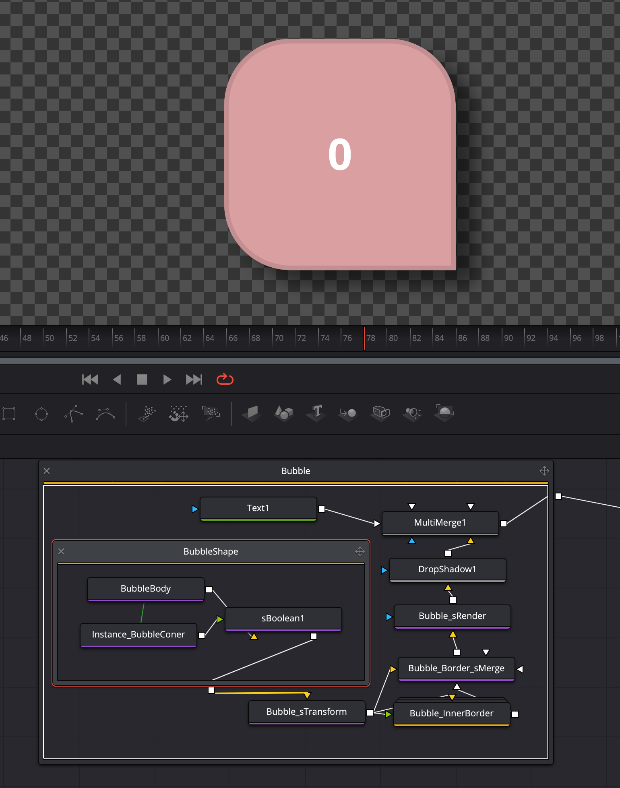
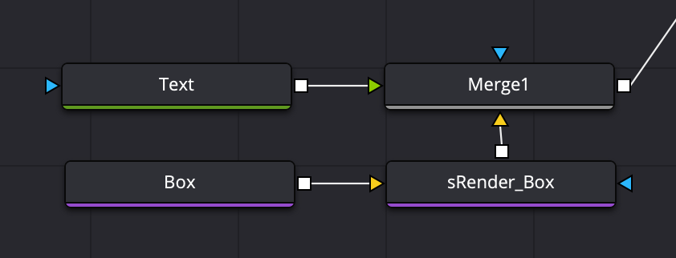

# General Davinci Resolve knowledge

## Instances
To create an instance copy a node and paste it with `cmd` + `shift` + `v`. A green line will point to the _"parent"_ element.



All properties of an instance point to its _parent_ and will update with them. A green outline marks the propertries that are connected to the parent.
To _deinstance_ a property and change it independent of the _parent_, right click on the name of the property to open the context menu and choose _Deinstance_.

## Shortcuts

<details>
<summary>

### Nodes Editor
</summary>

| Shortcut | Description |
| --- | --- |
| | **General:** |
`shift` + `space` | Add tool palette
| | **View selected node on:** |
`1` | Left viewer
`2` | Right viewer
`3`, `4`,... | Additional viewers if available (e.g. I/O card)
`~` | Clear all viewers
|  |  |
`cmd` + `f` | Find nodes in flow
`cmd` + `a` | Select all nodes in flow
`v` | Display Navigator
`cmd` + `shift` + `v` | Paste instance
copy of copied tool
| | **For all selected nodes do:** |
`F2` | Rename
`cmd` + `g` | Group
`cmd` + `t` | Swap FG/BG input
`cmd` + `l` | Lock/unlock
`cmd` + `p` | Pass Through / deactivate
</details>

<details>
<summary>

### Edit View
</summary>

| Shortcut | Description |
| --- | --- |
| `option` + `↑` | Move clip to higher row in timeline |
| `option` + `↓` | Move clip to lower row in timeline |
| `1` (customized) | **Split clip** |
| `2` (customized) | Trim/Ripple/**Start to playhead** removes everything in the selected clip piece from the start of the clip to the playhead. |
| `3` (customized) | Trim/Ripple/**End to playhead** removes everything in the selected clip piece from the end of the clip to the playhead. |
| `4` (customized) or `shift` + `delete` | Edit Timeline/**Ripple delete** |

### Workflow
Use `1` to split the timeline twice so that the part to remove is separated. Now select it and use `4` to remove it and move the clips together without a gap.

</details>

<details>
<summary>

### Keyframes & Render Range
</summary>

| Shortcut | Description |
| --- | --- |
| `cmd` + `<-` | First Keyframe |
| `cmd` + `->` | Last Keyframe |
| `cmd` + drag mouse | select range |
| `cmd` + drag mouse | select range |

</details>

# Writing Expressions in Davinci Resolve
Expressions can be used in the `Fusion` page of Davinci Resolve. You can use simple expressions or more complex [`lua`](https://lua.org/) script expressions.

## General
### Aspect ration
Sometimes you need to account for the aspect ratio vs reference size. E.g. if you have a `16:9` composition but a `1:1` reference aspect ration.

To position an `sRectangle` in the center you would use the following expression for the `Offset X`:

```
0.5
```

However for the `Offset Y` you need to divide this by `16/9`

```
0.5/(16/9)
```

## Simple expressions
A simple condition is just a calulation or similar and automatically returns the result. To show the expression field, type `=` into the value field and hit return or right-click the property name and choose `Expression`.
To remove the expression, right-click the property name and choose `Remove Expression`.

## iif — if in simple expressions
```
iif(MyGroup.Blend == 0, 0, 1)
```

## Point
```
Point(value1, value2)
```

## Text
```
Text(value1)
```

### Connect two values on the same node.
The simples expression is connecting two fields together. For example if you want `Width` to always equal `Height` you can just add `Height` into the expression field of `Width`.



## LUA basics

To enable `lua` mode, add a colon `:` to the beginning of your code. Use semicolons `;` to end a line. (You can not actually add new lines as this will break the code).
If you are in `lua` mode you need to `return` something from you script.

### If
In `lua` you can use [`if then`](https://www.lua.org/pil/4.3.1.html) conditions. Make sure to use `end` after the last return.

**Simple if else**
```lua
:if a > 1 then return 1 else return a end
```

**if elseif else**
```lua
:if a > 1 then return 1 elseif a < 1 return 0 else 0.5 end
```

**multiple conditions**
Use `and` if both conditions should be true or `or` if only one must be true.

```lua
:if (a <= 1 and a >= 0) then return a elseif (a > 1) return 1 else 0 end
```

### Variables
Define a variable using an `=` and used it via its name.
```lua
:a=1;b=2;c=b/a;
```

## Custom controls

### UI Explained
- `Passive` checkbox: The value of this input will not affect the rendered result, and does not create an Undo event if changed.
- `Animatable` checkbox: Allows you to keyframe a control AND to control it via expressions

### Dropdown menu
To create a dropdown menu use a `combo box` control. You can provide any label you want, but the value you get will be the index of the selected item, starting with `0`.

So if you dropdown has 4 items you get the following:
- top -> `0`
- right -> `1`
- bottom -> `2`
- left -> `3`

## Global Variables
While you can't really define global variables, you can fake it by using a node to hold them. This works especially well within `MacroOperators` (Macros) as the details will be hidden within it.

### Setup
- Create a new node, this can be any node, but `AlphaDivide` is a good one, as it has no properties on it's own.
- Give the node a good name (make it short as you will refer to it often).
  - `Global` or simply `G` could be good if you only use the values interally
  - I use `Control` or `Ctrl` when I make some of the properties available to the user of the macro
- add controls on this node using the `Edit Controls...` context menu
- if those variables don't need to change, e.g. a global `Padding` variable, you set all values, `default`, `range` and `allowed` to the same value
- if you want to calculate the value, make sure the control is set to `Animatable` and the `allowed` range is set to allow any possible value
  - now select the control node, right-click the control and choose `Expression`
  - any any expression to calculate this value, for example you could calculate the text box width and height and store it here to easily use it in other expressions

### Usage
Whenever you need one of those variables in an expression, you can now simply refer to them as `Ctrl.Padding` or `G.TextHeight`. This makes your expressions a lot cleaner, especially if you reuse the same value a lot.

# Examples

## A dropdown that alignes the corner of a box



### Setup
We have a `sRectangle` named `BubbleBody` with rounded corners of size `x1` and `y1`.
On top we have an _instance_ of this `sRectangle` named `Instance_BubbdleCorner` without rounded corners, _corner radius_, _offset x & y_ and _width_ and _height_ are detached. The size of this of instance is `x1/2` and `y1/2`. This small box is used to lay on top of one of the rounded corners to make it squared.
We also use a `sBoolean` set to `Union` to combine both into one shape afterwards.

The entire construct of nodes is in a _group_ named `Bubble`. On this group we have a custom control named `Tip` using a `combo box` with the four values: `top left`, `top right`, `bottom right`, `bottom left`. This is used to position the corner of the box.

### Expressions

On the `Instance_BubbdleCorner` we use the following expressions:
- width is set to: `BubbleBody.Width/2`
- height is set to: `BubbleBody.Height/2`
- X offset is set to: `:if(Bubble.Tip == 1 or Bubble.Tip == 3) then return BubbleBody.Translate.X + Width/2 else return BubbleBody.Translate.X - Width/2 end`
- Y Offset is set to: `:if(Bubble.Tip == 0 or Bubble.Tip == 1) then return BubbleBody.Translate.Y + Height/2 else return BubbleBody.Translate.Y - Height/2 end`

## A box that resizes to fit text


## Setup
We have a text node called `Text` and we expose the `Styled Text` property so the user can change it.
Below we have an `sRectangle` named `Box` which we want to change to fit below the text with some spacing all around.

## Expressions
We need to adjust the width and height of the `Box` using expressions:
- Width: `(Text1.Output.DataWindow[3]-Text1.Output.DataWindow[1])/Text1.Output.Width`
- Height: `(Text1.Output.DataWindow[4]-Text1.Output.DataWindow[2])/Text1.Output.Height`

## Set text color to black or white depending on bg color
To know when we need to change the text color we must know the _luminosity_ of the background color of our `Bubble` element.

Each channel needs to be multiplied with a specific number, if you want to learn more, there is a [W3C document with the algorithm](https://www.w3.org/TR/AERT/#color-contrast).
- Red - `0.299`
- Green - `0.587`
- Blue - `0.114`


The math behind it is the following
```
luminosity = Sqrt(
		(background.R^2) * 0.299 +
		(background.G^2) * 0.587 +
		(background.B^2) * 0.114
  )

if luminosity > 186 use Black 
else Colors.White;
```

We can solve this using an `iif` expression in the 3 color channels of the `Text` element. 
But there is no `Sqrt` (square root) function. Luckily an alternative is to use power of 1/2 (`^0.5`).

Our final formular is:
```
iif( ( (((Bubble.ColorRed*255)^2)*0.299 + ((Bubble.ColorGreen*255)^2)*0.587 + ((Bubble.ColorBlue*255)^2)*0.114 ))^0.5 > 186, 0, 1)
```

You need to add this expression to the `Red`, `Green` and `Blue` channel of the Text element.

# Reference

## Get height and width of a text
Sadly `Text1.Width` and `Height` return the timeline resolution, and not the actual size of the text box.
To get this you need to do some calculations using the `Text1.Output.DataWindow` property. The `DataWindow` prop is an object with four values:

```
ImgRectI = { left = 1733, bottom = 1013, right = 2104, top = 1147 }
```

You can retrieve an individual value using an index staring with 1. So `Text1.Output.DataWindow[1]` will give you the value for `left`, `1733` in the example above.

If you want to get the width you need to calculate the difference between the `left` and `right` values. But this gives you the pixel value. To turn this into the correct decimal value you need to devide it by the width of the composition `Text1.Output.Width`.

| Value | Expression |
| --- | --- |
Width | `(Text1.Output.DataWindow[3]-Text1.Output.DataWindow[1])/Text1.Output.Width`
Height | `(Text1.Output.DataWindow[4]-Text1.Output.DataWindow[2])/Text1.Output.Height`

## Composition values
| Description | Value |
| --- | --- |
Composition start (number of first frame) | `comp.RenderStart`
Composition end (number of last frame) | `comp.RenderEnd`
Number of current frame (kreyframne) | `time`

## Fusion expressions math library

| Description | Function |
| --- | --- |
| [Absolute value](https://en.wikipedia.org/wiki/Absolute_value) of x | `abs(x)` |
| [Arc cosine](https://en.wikipedia.org/wiki/Sine_and_cosine) of x in radians | `acos(x)` |
| [Arc sine](https://en.wikipedia.org/wiki/Sine_and_cosine) of x in radians | `asin(x)` |
| [Arc tangent](https://en.wikipedia.org/wiki/Tangent) of x in radians | `atan(x)` |
| Arc tangent of a/b (in radians), but uses the signs of both parameters to find the quadrant of the result. (It also handles correctly the case of b being zero.) | `atan2(a, b)` |
| Smallest integer(whole number) larger than or equal to x | `ceil(x)` |
| Cosine of x assumed to be in radians | `cos(x)` |
| [Hyperbolic](https://en.wikipedia.org/wiki/Hyperbolic_functions) cosine of x | `cosh(x)` |
| Angle x (given in [radians](https://en.wikipedia.org/wiki/Radian)) in degrees | `deg(x)` |
| The value e power x | `exp(x)` |
| Largest integer smaller than or equal to x | `floor(x)` |
| Remainder of the division of x by y that rounds the quotient towards zero. | `fmod (a, b)` |
| m and e such that x = m2e, e is an integer and the absolute value of m is in the range [0.5, 1) (or zero when x is zero) | `frexp(x)` |
| a2b – b should be an integer | `ldexp (a, b)` |
| The natural [logarithm](https://en.wikipedia.org/wiki/Logarithm) of x | `log(x)` |
| The base-10 logarithm of x | `log10(x)` |
| The maximum value among its arguments | `max(a, b)` |
| The minimum value among its arguments | `min(a, b)` |
| Value of pi | `pi` |
| Value of the base(a) to the exponent(b) power | `pow(a, b)` |
| The angle x (given in degrees) in radians | `rad (x)` |
| The sine of x assumed to be in radians | `sin(x)` |
| The [hyperbolic](https://en.wikipedia.org/wiki/Hyperbolic_functions) sine of x | `sinh(x)` |
| The square root of x | `sqrt(x)` |
| The tangent of x assumed to be in radians | `tan(x)` |
| The hyperbolic tangent of x | `tanh(x)` |

## Arithmetic Operators

| Description | Operators |
| --- | --- |
Add | +
Subtract | -
Divide | /
Multiply | *
Modulus divides and returns remainder | %
Exponent | ^

# Make macros stretchable / flexible / extendable

Use a `keyframe stretcher` node. Select the entire clip for source and the part that should be stretched for `Stretch Start` and `Stretch End`.

# Creating Macros / Templates

## Folder structure
To make a `.setting` file work correctly in Davinci Resolve you need to either generate a `.drfx` file or place it directly in the correct folder.
**Important:** You **MUST NOT** create subfolders. This will prevent your templates to work correct.

**DO:**
`Edit/Effects/Simple Title.setting`

**DON'T:**
~~`Edit/Effects/{Subfolder}/Simple Title.setting`~~

## Preview image
To get a small preview image for your template in Davinci Resolve you need to add a `.png` file with the same name as your template next to it.

E.g.
- `Edit/Effects/Simple Title.setting`
- `Edit/Effects/Simple Title.png` <- This is the preview image

The image has to have a size of `104px` x `58px`.

## Create a template / macro
After you create the nodes you want, select them and from the context menu choose create macro. Give it a name and make sure to select all inputs you want to be exposed in the sidebar when folks use your template.

**TIP:** You can select all nodes and copy (`cmd` + `c`) and paste them into a code editor. You can also copy the code from your editor and paste it into the fusion page.

## Create bundles / drfx

1. Create the following folder structure:

```
  - Edit
    - Effects
    - Generators
    - Titles
    - Transitions
```

2. Place your `.setting` file and the `.png` for the preview image in the correct folder, e.g. `Edit/Effects`.
3. Compress the `Edit` folder to a zip file
4. Rename the zip archive to the name of the Template e.g. `Simple Title` and change the extension to `.drfx`
5. You can now install the bundle by simple double-clicking it

# Audio

## Voice
Always use mono sound for spoken audio as most microphones record in mono. Otherwise the sound is panned to one side.

# Sources
- [Blackmagic Fusion Simple Expressions-Cookbook + Tutorial](https://noahhaehnel.com/blog/fusion-simple-expressions-cookbook/3/#Get_Maximum_or_Minimum_of_different_values)
- [lua.org](https://www.lua.org)
- [Jayaretv: Fusion Expressions](https://jayaretv.com/tips/fusion-expressions/)
- [Keyboard shortcuts](https://vfxstudy.com/wp-content/uploads/2020/02/Fusion-Keyboard-Shortcuts-v1.pdf)
- [Making Fusion Templates in DaVinci Resolve](https://www.youtube.com/watch?v=fLVIynCwQKM)